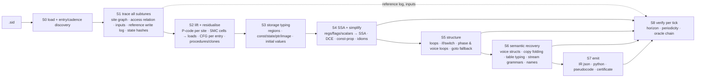

# tuneprog decompiler — design

Decompile a SID tune's 6502 playroutine into a **tuneprog**: a small, typed,
executable program that runs once per play call and is *proven per-call
equivalent* to the original on the only thing that is observable, the ordered
sequence of SID register writes. Nothing here is implemented yet; this document
is the design that the implementation must follow, with the HVSC surveys that
justify each decision (§9) and the plan to build it (§11).

Companion: [playroutine-anatomy.md](playroutine-anatomy.md) (what players are,
byte for byte). This document says how to recover that structure automatically.
Status: the prototype in [prototype-automatas.md](prototype-automatas.md) realises
S0–S8 in `deity_informant/tuneprog/`; five families are certified (Automatas,
Commando, Ghouls'n'Ghosts, GoatTracker 2, SID Wizard — 42 certificates) and
[tuneprog-plan.md](tuneprog-plan.md) records the lessons, the backlog, the
fold/stack gate and the next prototypes. [prototype-follin.md](prototype-follin.md) is the
second exemplar: all 32 subtunes of Follin's Ghouls'n'Ghosts, and the corrections
the operand-cell rule and the patched-branch model needed to get there.
[tuneprog.md](tuneprog.md) is the guide to what was built: module map, stages,
tools, certificate schema and the exemplars it is certified on.

Contents

1. Problem statement and definitions
2. Design principles
3. Architecture — the pipeline
4. The tuneprog IR
5. Stage designs (S0–S8)
6. Anatomy catalogue → mechanism (traceability)
7. Verification and certificates
8. Alternatives considered
9. HVSC survey — the population the design must serve
10. Scope
11. Implementation plan
12. Risks and open questions

---

## 1. Problem statement and definitions

**Tune.** A PSID/RSID container: a 64 KiB image (load band + everything the
machine supplies: power-on RAM pattern outside the load band, optionally the
KERNAL/BASIC ROMs), an `init(song)` entry, and a *play entry* — either the
header's `play` address called by the host, or an interrupt handler the tune
installs during `init` (raster or CIA), possibly a second one (NMI).

**Tick.** One invocation of a play entry. Ticks occur at the tune's *cadence*: one
per video frame (PAL 19656 cycles / NTSC 17095), or `latch+1` cycles for a
CIA-driven player (multispeed = several ticks per frame; a tune that rewrites
its latch during play has a *dynamic* cadence, which is why schedule effects
are part of the observable). "Per frame" in the task statement is "per tick";
equivalence per tick implies equivalence per frame and is the only useful
notion for multispeed players.

**Observable.** The ordered list of `(address, value)` SID writes made during a
tick ($D400–$D7FF, i.e. registers and their mirrors, per chip), plus the
*schedule effects* — writes that change when the next tick happens (CIA latch
and control registers, raster compare) — and the same list for `init(song)`.
Two ticks are observationally equal iff their lists are equal. Within a tick,
order matters only through gate/TEST edges and last-write-wins, and the exact
cycle offset of each write matters only to the envelope generator's reaction to
very short gate/TEST pulses; the strict definition (equal ordered lists) is what
is certified because it is cheap and needs no SID model, and an optional
*cycle-annotated* mode adds a cycle offset per write (the lifter's cycle tables
make this an ordinary accumulator in the IR) for renderers that want it.

**Inputs.** Reads whose value the program does not determine: raster position
($D011/$D012), CIA registers, SID read-back ($D41B/$D41C, and reads of write-only
SID registers), interrupt-acknowledge reads ($D019/$DC0D), host-supplied
registers at entry (A/X/Y at `init`/`play`), and RAM the tune never wrote and
the image does not cover (power-on pattern). A tuneprog takes these as an
explicit input stream; equivalence is stated relative to the recorded stream.

**Tuneprog.** A triple `(storage, procedures, meta)`:

- *storage*: named regions with types and initial contents — the tune's state
  (mutable) and its data (constant tables, the score);
- *procedures*: `init(song)` and one `tick_k()` per play entry, in a small
  imperative IR (§4) whose only side effects are stores to storage, SID writes,
  and input reads;
- *meta*: cadence/schedule, subtunes, SID model dependence, and the
  **certificate** (§7): the horizon over which equivalence was checked, and
  whether the state was proven periodic (then equivalence holds forever).

**Equivalence.** For each subtune, starting from the post-`init` state,
`tuneprog.tick` and the 6502 program produce identical write lists for every
tick `0..N−1` (the horizon, ≥ the HVSC song length), given the same input
stream. *Complete* equivalence: additionally the tuneprog's state at some tick
`k` equals its state at `k+p` with no inputs consumed → the write sequence is
periodic from `k` on and the check over one period covers all future ticks.

**Goal.** For as much of HVSC as possible, produce a tuneprog that (a) is
certified equivalent, (b) is *high level*: registers, flags, self-modifying
code, addressing modes and unrolled copies are gone; state is named per-voice
and global variables; tables are typed; the tick is structured
(`switch(phase)`, `for voice`, `while(fetch)`), approaching the "player in 30
lines" of the anatomy document — and (c) is produced automatically at HVSC
scale (60k tunes, ~650 player families) in hours, not weeks.

The output serves three consumers: humans reading a player, tools extracting
the score/instruments (a tuneprog is a player *plus* typed data — the format
parsers in `pysidtracker`'s family are hand-written special cases of it), and
re-implementation on other targets (the tuneprog is executable and portable).

---

## 2. Design principles

1. **The executable IR is the truth; text is a view.** Every stage produces an
   IR that runs. Structuring, naming, folding are *presentations* of the same
   semantics, each re-verified. Readability never trades against exactness.
2. **Dynamic first.** Playroutines are deterministic functions of (state,
   inputs) that we can execute for their entire life. Executed sites, exact
   read/write sets, index-register domains, SMC variants, computed-jump targets,
   JSR/RTS pairing, flag liveness — all are *observed*, not inferred. Static
   analysis is used only to close small gaps (bounded walks from executed
   branch sites) and is labelled unverified.
3. **Verify everything, always.** Per-tick differential execution against the
   emulator is part of the pipeline, not a test suite. A tuneprog without a
   certificate is not emitted. This turns "is the decompiler correct?" into
   "does this tuneprog reproduce this tune?", answerable per tune.
4. **Exact memory model from the access relation.** Which bytes form a
   variable, an array, a pointer, a table, is computed from what the executed
   code touched (§5.3), never from heuristics. Heuristics only choose *names*
   and *layouts of presentation* (voice structs, columns), and even those are
   re-verified when they change the IR.
5. **Per tune, per subtune.** No dependency on player identification. Family
   knowledge (SIDId signature → source names, GT2's `player.s` labels) is an
   accelerator and a namer, never a prerequisite. Blackbird and GT2 emit a
   different player per tune; the design must not care.
6. **Refuse loudly.** Unsupported constructs (a second concurrent interrupt, ROM
   dependence beyond a budget, non-terminating init, envelope violations)
   produce a diagnosed refusal, never a silently approximate tuneprog.
7. **Reuse.** `deity_informant` supplies the illegal-aware lifter with byte
   provenance (`prov`) and the validated `PcodeVM` (volatile model, IRQ drivers,
   power-on RAM, PSID loader); `pysidtracker` supplies init tracing, cadence
   derivation, HVSC/oracle plumbing and note-table detection; `sidtrace`
   (sidplayfp) is the ground-truth oracle; `networkx` for dominators/loops;
   `numpy` for trace arrays. New code is the tuneprog-specific middle: regions,
   SSA over P-code, structuring, idioms, emit, verify.
8. **Lift every executed instruction; present none of them.** Instruction-level
   lifting is where soundness is cheapest (the lifter exists and is validated
   against py65 and sidplayfp), so the pipeline never guesses at an idiom's
   meaning — but the *output* is at the level of the anatomy's pseudocode
   because SSA + DCE discard almost everything an instruction says (flags,
   register shuffles, addressing modes, self-modification). What is
   deliberately *not* modelled: unexecuted code (dead for the tune, `trap`),
   cycle-level timing (only as an optional annotation), CPU registers/flags
   and the stack (registers and flags are procedure-local values; the stack is
   eliminated in S4 or explicitly residual),
   the SID/VIC/CIA as devices (inputs are pinned, outputs are lists), and any
   musical semantics beyond what the exact storage typing yields.

---

## 3. Architecture — the pipeline



Stage outputs are files, so each stage is independently testable and a failure
is diagnosed at its stage. S8 runs after every IR-changing stage; the emitted
certificate names the last stage that verified.

Two products come out of S4 already: a **trace-closed** tuneprog (only executed
code; unexecuted branch directions and unobserved SMC opcode variants become
`trap`) — the certified core — and, optionally, a **closed** tuneprog that also
lifts statically reachable code from executed branch sites (bounded walk),
which is faithful if the lifter is (it is validated against py65/sidplayfp) but
unverified by execution and marked as such.

---

## 4. The tuneprog IR

Small on purpose: everything a playroutine does is byte/word arithmetic on a
few hundred bytes of state, table lookups, and stores to 25 registers.

```
Tuneprog  = { meta, storage: [Region], inputs: [Input], procs: {name: Proc} }

Region    = { name, base: u16, size, kind ∈ {state, const, image, io},
              elem ∈ {u8, u16le, u16be, ptr16, code_ptr},   -- presentation type
              init: bytes,                                     -- pre-init (image) contents
              layout?: { stride, fields: [name] },             -- struct-of-arrays view
              roles?: [ "sid_shadow:$D404+7v", "freq_table", "cursor:PATTERNS", ... ] }
Input     = { name, addr, kind ∈ {raster, cia, sid_readback, ack, entry_reg, uninit_ram},
              pinned: [(tick, value)] }                        -- the recorded stream
Proc      = { name, params: [u8], body: [Block] | Structured }
Block     = { label, stmts: [Stmt], term: Term }
Stmt      = let v = Expr | store(R, idx: Expr, val: Expr) | sidw(addr: Expr, val: Expr [, cyc: Expr])
          | iow(addr: Expr, val: Expr) | call(proc, args) | assert(Expr)
Term      = goto L | if Expr then L1 else L2 | switch Expr {k: L, ...; default: trap}
          | return | trap(reason)
Expr      = const | v | load(R, idx) | input(I) | unop(Expr) | binop(Expr, Expr)
              ops: + - & | ^ << >> (logical) , cmp: == != < <= (unsigned), ?: (select)
types     = u8 | u16 | bool   (widths are explicit; wraparound is explicit via & 0xFF)
Structured= if/else, while, for v in (a..b step s), switch, break/continue, goto (fallback)
```

Semantics are the obvious ones; `sidw` appends to the tick's write list, `iow`
(VIC/CIA stores) to its schedule-effect list; `load` of a `state`/`image`
region reads the current byte(s); `const` regions fold.
Indices are checked against the region's observed extent (`assert` → `trap
"envelope"` beyond it, §5.3). Registers and flags do not exist in the IR — they
are ordinary `let` values (SSA) that the printer usually inlines.

**Executable forms.** (1) A reference interpreter over the JSON IR (slow, exact,
used for the certificate); (2) generated Python (one function per proc; the
default S8 executor); (3) later, numba-compiled generated code for campaigns
(the IR uses only fixed-width integers and flat byte arrays, so it is
numba-friendly by construction). All three must agree — the interpreter is the
semantics.

**Text form.** A pseudocode printer (the anatomy document's style): named
regions, structured control flow, `sid[v].ctrl = ...` for writes into voice
blocks, `T16[i]` for typed tables, token-class comments on stream reads.

**Illustration** (target of S5/S6 for `Commando.sid`, hand-written from the
anatomy §3.1 to show the shape; the real output will differ in names):

```
state:  voice[3] { pos, pat, lengthleft, savelnthcc, voicectrl, note, instr, portaval,
                   savefreq: u16, pulsedelay, pulsedir }
        counter, mstatus, speedctr, speed, music_allowed, sfx { ... }
const:  FREQ: u16le[96] @ $5428 ; INSTR: u8[13][8] @ $5591 ; SFX: u8[16][16] @ $55F9
        SONGS @ $56FF ; PATLO/PATHI: u8[45] ; TRACKS ; PATTERNS (stream, grammar §3.1.4)

tick():
  counter += 1
  if mstatus & $80: ...; goto sfx
  if mstatus & $40: lazy_init()
  speedctr -= 1; if speedctr < 0: speedctr = speed
  tick0 = (speedctr == speed)
  for v in 2..0:
    if tick0:
      voice[v].lengthleft -= 1
      if voice[v].lengthleft < 0: fetch_note(v); goto tail
      if music_allowed and !(voice[v].savelnthcc & $20) and voice[v].lengthleft == 0:
        sid[v].ctrl = voice[v].voicectrl & $FE; sid[v].ad = 0; sid[v].sr = 0
    if music_allowed: soundwork(v)
  tail:
    music_allowed = !(sfx_enabled and sfx_active)
  music_allowed = $FF
  sfx_step()
```

The same tune's speed divider (`$5052 DEC $5513 / BPL / LDA $5517 / STA $5513`)
at the three levels the pipeline passes through — raw P-code (`INT_SUB`, N/Z
flag ops, `STORE`, `CBRANCH` on the N varnode), the S4 certified core, and S5:

```
S4:  B0: let t0 = (load(speedctr) - 1) & $FF ; store(speedctr, t0)
         if (t0 & $80) == 0 goto B2 else goto B1
     B1: store(speedctr, load(speed)) ; goto B2
S5:  speedctr -= 1 ; if speedctr < 0: speedctr = speed
```

---

## 5. Stage designs

### S0 — Load, entries, cadence

- Parse the container (`c64.load_psid`, `psid_image`, `psid_songs`); build the
  64 KiB machine image = power-on pattern (`c64.poweron_ram`) ⊕ load band; ROMs
  optional (`pysidtracker.roms`), off by default.
- Run `init(song)` for every subtune under the tracer with a write observer
  (`pysidtracker.trace_init` semantics: $0314/5, $0318/9, $FFFA–$FFFF, CIA
  latches/control/ICR, $D011/$D012/$D01A). Derive the **schedule**: the list of
  play entries per frame with their trigger (video frame or CIA latch), using
  `pysidtracker.playroutine_cadence` for the primary source and the observed
  vectors for the entries. `play ≠ 0` → entry `sub(play)`; `play = 0` → the
  installed handler(s), entered with the IRQ frame (`vm.run_irq`); a `JMP *`
  or an equivalent idle loop ends a non-returning `init` (§9 measures how often).
- Emit `meta.schedule = [{entry, kind: sub|irq|nmi, cycles_per_tick, source}]`
  and `meta.subtunes`.
- Run `init` under sidplayfp's interrupt model: if `init` enables interrupts
  and spins (a repeating pc set with no state change) while a source it armed
  is due, deliver that interrupt (`vm.run_irq_driven` nesting) and continue;
  a PSID init that waits for its own raster IRQ (Sound-Tracker 64, §9.8)
  terminates this way, and the handler it waited for is the play entry.
- Machine model in the tracer: the 6510 port (`$00` direction, `$01` data →
  effective bank: I/O mapped, RAM under I/O, or character ROM) so that a
  `$D4xx` store is a SID write only when I/O is mapped (`sidw`) and otherwise
  a RAM store; a minimal CIA (timers count at cycle rate, ICR flags on
  underflow, latch reload) so busy-waits on `$DC04`/`$DC0D` behave; VIC raster
  from the cycle counter as today. All are inputs to be *pinned*, not
  simulated by the tuneprog.
- Refuse (with reason) when: `init` neither returns nor idles within budget; no
  play entry can be found; a second concurrent interrupt source is armed (NMI
  sample mixer, raster split chains) — v1 scope, §10; the trace executes ROM
  addresses without ROMs supplied.

### S1 — Trace

One instrumented run per subtune for `N` ticks, `N` = HVSC song length + margin
(or until state periodicity is proven, whichever is first; cap configurable).
The instrument is a `PcodeVM` subclass (the survey prototype
`tools/survey/tracer.py` is its skeleton). Recorded, keyed by **site** = (pc,
instruction bytes):

| record | use |
|---|---|
| execution count; phase (init/tick/entry kind); subtune | code recovery, dead-path trimming, per-entry CFGs |
| per P-code op: read set, write set (exact) | regions (S3), SMC writers, volatile classification |
| index register value at indexed sites (X or Y domain) | array extents/strides, voice-loop recognition |
| successors: fall-through, branch taken/not, JMP, JMP(ind) targets, JSR→callee, RTS→return pc with the JSR it matched (or none) | CFG, procedure boundaries, computed switches |
| SID writes per tick, in order (`wlog`) | reference log for S8 |
| input reads: (site, tick, value) for every IO/uninitialised/entry-register read | pinned input stream |
| per tick: instructions, cycles, `blake2b(state footprint)` | cost, periodicity certificate |
| instruction bytes seen per pc (variants) | SMC opcode/operand cells |

Cost: ~200 k instructions/s in Python (survey figure); a full song at
300 instructions/tick is 10–60 s. Optional later: a numba 6502 core producing
the same arrays (§11).

State footprint = the set of RAM addresses written by any tick so far;
`hash(footprint contents)` per tick with the footprint size as part of the key.
A repeat `(k, k+p)` with no input reads is the periodicity witness.

### S2 — Lift and residualise; CFG and procedures

**Lift.** Each site → its raw P-code record (`lift`), taken from the *post-init
image bytes of that variant*. Then residualise:

- *operand cells*: an operand byte that any traced op writes **in any phase,
  `init` included**, is a variable: the lifter's `prov` map says which const
  varnodes derive from which byte offsets; replace them with `LOAD` from the cell
  address (immediates → `load(cell)`; absolute address bytes → the address becomes
  `load16(cell)` + index; branch offsets and JMP operands → computed control,
  below — a patched *conditional* branch keeps its condition and puts the taken
  side's targets in the switch). Excluding `init` from the rule is wrong even for
  the tick's sake: Follin's rip loader patches the operand of its own `CPY #` once
  per song block and consumes it inside `init`, so a site keyed on the post-init
  byte runs the first block's copy loop with the second block's count. Cells
  patched only by `init` (SID Wizard's relocations, Galway's API vectors) are
  constants as far as the tick code is concerned: S4 folds a known-address load to
  its post-init byte in the procedures `init` never reaches, so the residualisation
  costs the tick nothing, while `init` itself keeps the load its own store defines
  and a multi-subtune build folds nothing.
- *opcode cells*: a pc with several opcode variants → one node per variant,
  entered through `switch(load(pc)) {variant: node ...; default: trap}`.

**Edges.** From observed successors. `JMP (ind)`, RTS-trick returns, and
patched jumps/branches become `switch(target expression) {observed targets;
default: trap}` where the expression is the pointer or cell read at that site,
or -- once S4 has eliminated the stack -- the halves an RTS trick pushed
(e.g. `switch(load16($6375))` for Follin's patched JMP; the domain is
also known statically when the writers copy from a constant table — S6 names
it as a jump table).

**Procedures.** Entry points = the play entries, `init`, and every JSR target.
The trace pairs each RTS with the JSR it returns from; a procedure's body is
the node set reachable from its entry through non-return edges up to its
matched RTS nodes. Nodes reachable from two entries (shared tails, `JMP` into
another routine, fall-through into the next routine) are **cloned per entry** —
context-sensitive, cheap at these sizes (≤ ~1000 sites), and it removes every
"tail jump/shared exit/fall-through" idiom of anatomy §5.4 by construction: an
edge into a procedure entry that is not a JSR is a *tail call* (`call f;
return`), an unmatched RTS is a computed goto to its observed targets, a JSR'd
routine that never returns to its caller (JCH's `JMP $4742` structure, SW's
handlers) simply owns the tail it jumps to. Recursion is refused (none
expected; §9).

**Call summaries.** From the trace: registers/flags a callee reads before
writing (live-in) and writes (defs), and the regions it touches. Callers treat
a call as use of live-ins/def of defs. Flag arguments across `JSR` (anatomy
§6.2) need nothing special.

### S3 — Storage typing: regions

Access units are P-code ops (a `(zp),Y` load is two ops: pointer fetch and
target load, so pointer bytes and stream bytes never merge). Build the graph on
addresses: connect the addresses touched by one op (its footprint), then take
connected components → **regions**. Properties:

- every op touches exactly one region; regions are disjoint by construction —
  aliasing is *exact*, not approximated;
- size-1 regions are scalars; larger regions are arrays with `base = min`, and
  an op's index expression is `addr_expr − base` (0 for constant addresses);
- kind: `state` if any decompiled procedure writes it (init included; a
  region written only by `init` — Follin's copied song blocks, zero-filled
  workspaces — is tagged `init-constant` so the printer can present it as a
  table), `const` if only read and inside the load band (fold into
  `load(const)` → table),
  `image` if only read and outside the band (power-on pattern → constant,
  recorded as an input class for honesty), `io` for $D000–$DFFF (SID writes →
  `sidw`; VIC/CIA writes kept as stores to an `io` region for faithfulness;
  reads → inputs);
- initial contents = the *pre-init* image (load band over the power-on
  pattern); `init(song)` is a decompiled procedure like any other, so
  subtune-dependent patching (GoatTracker packs' per-subtune `JMP $xx00`, SID
  Wizard's SUBTUNES relocation) is ordinary stores into `state` cells that the
  tick code then loads. The printer may show a post-init snapshot for
  readability; the executable form runs `init`;
- SMC operand cells are `state` scalars like any other; opcode cells are
  `state` scalars read by the variant switch.

**Envelope.** An indexed access at run time whose address falls outside its
region's observed extent traps (`envelope`). This is what makes promoted
scalars sound: no unobserved access can alias them. Inside the certified
horizon it never fires (by construction); a periodicity certificate extends
that to all ticks; beyond an unproven horizon it is the honest failure mode.

Layout hints for S6 come free: for a region indexed by X with observed domain
D, `stride = gcd(D − min D)`, fields = distinct constant offsets mod stride
(GT2 blocks: D = {0,7,14}, stride 7; Hubbard: D = {0,1,2}, stride 1, 12
one-field regions of size 3).

*Prototype evidence* (instruction-level access relation from the survey tracer,
30 s of music, nine exemplars): 40–128 regions per tune; the per-voice fields
appear as size-3 arrays with the anatomy's index domains — Hubbard `$54EC..`
{0,1,2}; GT2 `$148C..$14BB` and SID Wizard `$1024..` and Blackbird `$12EE..`
{0,7,14}; defMON `$101B..$135E` {0,49,98}; JCH's mixed 3/4-wide rows; Walker's
page-2 triples — GT2's 25-byte ghost image and 42-byte A+B block (one region
because init zeroes it with one loop; the play-time stride view still splits it)
and the zero-page pointer pairs are isolated. The one artefact of the
instruction-level prototype (a `(zp),Y` site merges its pointer bytes with the
stream it reads, giving 20 KiB "arrays") is exactly what the op-level relation
of the real front end removes.

### S4 — SSA and simplification

- Variables: A, X, Y, SP, C/Z/N/V (D/I/B tracked but almost always dead), each
  `state` scalar region; arrays stay as ordered memory (stores are statements),
  `const` regions are pure. Standard SSA construction (dominance frontiers via
  `networkx`) per procedure; calls use the S2 summaries.
- Simplification: copy/constant propagation (post-init image constants),
  dead code elimination (flag computations nobody branches on — the bulk of
  P-code — vanish; junk stores like Hubbard's `STX $5528` vanish because no
  read exists), algebraic peepholes.
- Flags-as-values (anatomy §5.3, §7) need no special pass: `C` defined by a
  `CMP` forty instructions earlier and consumed by an `ADC` is an SSA value
  whose defining expression is `(A_k >= imm)`; the `ADC` becomes
  `t = a + b + (A_k >= imm)`. Known constants fold (`CLC; ADC` → `a + b`);
  data-dependent carries stay symbolic — exactly right.
- Idioms (rewrite rules on the SSA graph, each unit-tested with assembled
  snippets): compare+branch → relational; `DEC/INC` + branch → `if --x < 0`;
  8-bit add/sub carry chains on adjacent scalars or lo/hi arrays → 16-bit ops;
  `ASL;TAY;LDA t,Y;LDA t+1,Y` → `T16[i]`; `INC lo;BNE;INC hi` → `ptr += 1`;
  shift loops → variable shifts; `BIT` N/V tests → `(m & $80)`, `(m & $40)`.
- Stack elimination (`frames.py` proves it, `stack.py` does it, once the
  passes have converged): a
  procedure's stack pointer is its entry value plus its own pushes and pops, so
  every access names a slot. Where every load on the page is *must*-defined by
  pushes of its own frame, the page is dead storage: a push becomes the value
  its pops read (two pushes one pop can read are one value with two
  definitions), a `PHP`/`PLP` round trip leaves the flag algebra the bit
  idioms already fold, a return-address push is the continuation the `Call`
  carries, and `SP` leaves every signature. A read the analysis cannot place —
  a scratch area addressed by a non-constant offset, a `TSX`-relative read of
  another frame, an interrupt entry frame — can see any byte of the page, so
  the program keeps its machine stack and the certificate names the procedures
  that made it residual. The page is outside the periodicity footprint on both
  sides (the tracer's hash and the machine's hash exclude it — a `PHA` is machine
  texture, like the JSR frames the `raw` class already keeps out of the write
  log), so this moves no certificate except where stack scratch had been delaying
  a state repeat, which only shortens the horizon.
- Result: an executable, register-free, flag-free, stack-free, SMC-free program
  in basic-block form. **This is the first certified product** (S8 runs here).

### S5 — Structuring

Standard structural analysis over the reducible-after-cloning CFG: natural
loops from the dominator tree (voice loops `DEX;BPL`, `SBX #7;BPL`, copy
loops, `while(fetch)` sequencer loops), if/else from post-dominance,
`switch` from the S2 multi-way terms and from compare chains on one value,
`goto` for the residue. Then two 6502-specific recognitions, both
presentational: the **phase variable** (the state scalar whose comparisons
with constants dominate the tick — `speedctr`, `counter`, `SPDCNT`, `$E6` —
lifted to `switch(phase)`), and the **voice loop** (induction variable with the
observed domain {0,1,2} or {0,7,14}, or three consecutive calls of one
procedure with X = constants → `for v in ...: proc(v)`). Structuring never
changes semantics; the state-machine form remains available as fallback.

### S6 — Semantic recovery (presentation, each step re-verified if it edits IR)

- **Per-voice structs**: regions sharing an index domain and stride are grouped
  into `voice[v].field` views; scalar triples at `base+v` (Follin/Hubbard
  stride 1) likewise. Ghost/shadow detection: a region whose bytes flow
  unchanged into `sidw` (GT2's 25-byte image, JCH's shadows) → `sid_image`
  role, and the flush loop prints as `sid[0..24] = image`.
- **Unrolled copies** (Galway/Follin voices, Walker's four modulators): find
  procedures/loop bodies whose IR is identical modulo operands, with operand
  vectors affine in a copy index; merge into one parameterised procedure and
  union the regions (this *edits* IR → re-verify). Optional; without it the
  output is correct but three times longer.
- **Tables**: element width from index scaling, parallel columns (same index
  into regions at constant offset), 1-based (`base−1,Y` with observed Y ≥ 1),
  pointer tables (lo/hi columns whose values are addresses read by streams),
  the frequency table (`pysidtracker.notefreq.locate_note_freq`: 96 ascending
  16-bit values with ratio 2^(1/12)), jump tables (S2 switch domains).
- **Stream grammars**: for a stream read (a `const`/`state` region indexed by a
  cursor or a pointer) whose value feeds compare/bit-test trees, extract the
  decision tree over the byte → token classes with thresholds (anatomy §8.3),
  emitted as a comment table on the region. Presentation only.
- **Names**: roles first (sid shadows by register, freq table, counters/timers
  by `DEC…reload` shape, cursors by "indexes region R", pointers by `(zp),Y`
  use, phase, voice); then an optional family dictionary keyed by SIDId
  signature (GT2 `player.s`, SW `player.asm`, undefmon, Blackbird guide labels)
  matched by structural position, never trusted for semantics.

### S7 — Emit

`tune.tuneprog.json` (IR), `tune_tuneprog.py` (executable), `tune.tuneprog.md`
(pseudocode + tables + grammar comments), `tune.certificate.json`.

### S8 — Verify

For each subtune: execute the emitted program from the pre-init image
(`init(song)` then `tick()` × N, feeding the pinned inputs) and compare the
per-tick write lists with the S1 reference log; on mismatch report the first
divergent tick, write index, and the IR statement/site. Then the periodicity
check (state equality at `k` and `k+p`, no inputs) → `complete: true`. The
reference itself is validated against sidplayfp per frame (`tests/test_oracle.py`
via `pysidtracker`'s `sidtrace` bridge), closing the chain
sidplayfp ⇐ PcodeVM ⇐ tuneprog. Relaxed comparison (final value per register +
gate/TEST edge multiset) is offered as a diagnostic, not as the certificate.

---

## 6. Anatomy catalogue → mechanism

| anatomy item | where | mechanism |
|---|---|---|
| struct-of-arrays stride 1 / stride 7, voice→SID offset tables, `CPX` chains, unrolled voices, unrolled modulators (§5.1) | S3, S5, S6 | regions with index domains → strides/fields; voice-loop recognition; copy folding |
| index-register borrowing, Y reloads, stack as scratch, register-held 16-bit accumulators, `INX/DEX` hi-byte adjust (§5.2) | S4 | SSA makes registers disappear; a PHA/PLA pair is one value (`frames.py`/`stack.py`), a scratch *area* keeps a residual stack; 16-bit idioms are peepholes |
| illegal opcodes incl. `NOP #imm` overlapping streams (§5.2) | S1/S2 | trace keys sites by (pc, bytes); the lifter already knows all 105 illegals; two overlapping decodings are two sites |
| flags as data: `BIT` N/V, V from SBC, tick number as bit mask, C across JSR, C across 8–40 instructions, branch into `CLC;SBC`, 9-bit shift via carry (§5.3, §7) | S4 | flags are SSA values; call summaries carry them across JSR |
| tail JMPs, shared tails, fall-through tail calls, loops entered from the middle, `BIT` skip chains, RTS trick, patched JMP/JSR/branch dispatch, compare-chain dispatch, entry into the middle of a routine (§5.4) | S2, S5 | observed edges; clone-per-entry; unmatched RTS / patched operand → switch over observed targets; structuring |
| SMC: immediates as variables, operand addresses as pointers (broadcast), opcode as boolean/gate/sign/config, computed `STA` operand, register save into immediates, patched data tables, init-time relocation, `JMP`↔`RTS` (§5.5, §6.5) | S2, S3 | residualisation via `prov` (operand cells → loads), variant switch (opcode cells), post-init image folds init-only patches; data-table patches are ordinary stores to `state` regions |
| sentinels, variable-length records, byte-range token classes, packed rests, eager terminator peek, 1-based tables, parallel columns, bytecode tables, next-byte loop markers, overloaded entries, pre-shifted constants, quarter-tone sums, overlapped freq arrays, PW linearising LUT, LZ decompression inside play, positional token classes (§5.6) | S3, S6 | regions type the storage exactly whatever the trick (overlapping arrays are one region; the LZ ring buffers are `state` arrays filled by the lifted unpacker); grammars/columns/typing are S6 presentation |
| free-running counter as LFO phase, inverted countdown rate, one-shot pre-load loops, `$D41B` random, keyboard-character scores, countdowns, ghost image flush, everything-from-shadows, look-ahead hard restart, pipeline hard restart, TEST pulses, voice arbitration by loop order, two-flag handshake with an NMI, dither frame skipper, three-phase tick, row timer as phase and index, swing by EOR, host sync register (§5.7) | S1, S4, S5 | all are ordinary computations once registers/flags/SMC are gone; `$D41B`/host cells are inputs; the NMI case is out of v1 scope (§10) |
| roots/reachability, post-init image, data inside code, wrappers, non-re-entrant init (§6.1, §7 control flow) | S0, S1, S2 | executed sites are the code; regions are the data; per-subtune init runs |
| calling conventions, IRQ frames, return values (§6.2) | S0, S2 | entry kinds carry the frame; live-in/def summaries |
| table typing rules (§6.3) | S3, S6 | as above |
| phase variable first (§6.4) | S5 | phase recognition |
| volatile inputs, SID-model dependence (§6.6) | S1, S7 | pinned input streams; `meta.sid_model` when `$D41B` at init selects patches (both variants can be traced by pinning both models) |
| verify against write logs at frame/call granularity (§6.7) | S8 | the certificate |
| traps: table overruns, `base−1`, `LDY abs,X`, `BIT` operand reads, residual workspace, junk stores, no-op first call, ghost latency, register written as data (`$85`), multi-write per frame (§7) | S1–S4 | exact regions (overrun addresses are just part of the region), post-init image, DCE, `sidw(reg = expr)` with a data-dependent register, ordered write lists |

---

## 7. Verification and certificates

`certificate.json`:

```
{ "oracle": "deity_informant.PcodeVM@<version>", "reference_validated_against": "sidtrace@<tag>|none",
  "compared": ["init writes", "tick sid writes", "tick schedule effects", "cycle offsets"?],
  "subtunes": [ { "song": n, "ticks": N, "seconds": s, "inputs_pinned": k,
                  "period": p|null, "complete": bool, "closure": "trace|static" } ],
  "stage": "S4|S5|S6", "divergence": null | {tick, index, expected, got, site} }
```

The periodicity check is run on the *tuneprog's* state (its regions) as well as
on the emulator's footprint; both must repeat at the same `(k, k+p)`.

Horizon policy: N ≥ HVSC length + 5 s of ticks; stop early when a period is
found; hard cap by wall time. Multispeed: N counts ticks. Multi-entry schedules
(v1: single entry) would carry per-entry logs.

Cost budget per tune (Python): trace 10–60 s, verify 5–30 s; campaign over HVSC
≈ 300–400 CPU-hours → 4–6 h wall on 72 cores (§9 sizing). Acceptable for a batch;
the numba tracer/executor is the lever if it is not.

---

## 8. Alternatives considered

- **Static decompilation (Ghidra with the repo's 6510 SLEIGH module).** Correct
  for straight code; defeated in practice by SMC operand cells (constants to a
  static tool), patched dispatch, data inside code, unrolled copies, and no
  notion of per-tick equivalence. Kept as an inspection tool; its output is not
  executable against a write log. The 6510 module remains valuable for
  humans and for cross-checking lifts.
- **Register-log tools (desidulate, VICE dumps).** Data, not a program: nothing
  generalises beyond the recorded frames and no structure is recovered.
- **Per-family hand parsers (`pygoattracker`, `pysidwizard`, …).** Exact and
  readable for their family, but ~650 families and per-tune player variants
  (GT2 packer, Blackbird) make hand-writing them the slow path; the tuneprog
  decompiler produces the equivalent artefact automatically and can *use* the
  hand-written players as extra oracles.
- **Symbolic/concolic execution to reach unexecuted paths.** Unnecessary: the
  tune is finite and deterministic; periodicity proves completeness for
  looping songs; the remaining unexecuted code is dead for that tune.
- **Full inlining instead of procedures.** Simpler SSA, but triples the
  voice engine for the JSR-per-voice players (GT2, SW) and destroys the
  natural `for v: DOTRACK(v)` — procedures with clone-per-entry keep both.
- **Learning grammars/semantics (ML).** Not needed for equivalence and cannot
  certify; the exact access relation gives typing for free.

---

## 9. HVSC survey — the population the design must serve

Two instruments, both in `tools/survey/`: `headers.py` (static census, joined
with the SIDId family from `hvsc-tracker-catalog`) and `tracer.py`/`run.py`
(the S1 tracer in prototype form; `report.py` renders the tables). Numbers are
from runs on 2026-08-16 against HVSC #85 as installed.

**Method.** Population: 61,157 files, 646 SIDId families. Static census over
all files; dynamic trace of a stratified sample (up to 30 tunes per family,
seed 1; 7,023 tunes; 60 s of music per tune at its own cadence; the default
subtune). Rates are given raw over the sample and re-weighted to the HVSC
population by family size, so a family with 10,000 tunes counts 10,000/30 per
sampled tune and a 3-tune family counts 1. Caveats: the prototype VM has no CIA
timer/6510-port emulation and attributes memory accesses per instruction (the
production front end does both better, §5); "period found" is bounded by the
60 s horizon.

### 9.1 Outcomes of the dynamic trace (sample of 7023 tunes, 646 families)

| outcome | tunes | raw | HVSC-weighted |
|---|---|---|---|
| traced OK | 6363 / 7023 | 90.6 % | 97.0 % |
| init never returns/idles (RSID main loops, digi, BASIC) | 494 / 7023 | 7.0 % | 1.5 % |
| no play entry found (play=0, no vector installed) | 153 / 7023 | 2.2 % | 1.4 % |
| play error (runaway/JAM/unlifted opcode) | 10 / 7023 | 0.1 % | 0.1 % |
| per-tune wall timeout (very fast CIA cadence or heavy ticks) | 2 / 7023 | 0.0 % | 0.0 % |
| init error | 1 / 7023 | 0.0 % | 0.0 % |
| harness error | 0 / 7023 | 0.0 % | 0.0 % |

Failure families (top, by HVSC weight): 4753_Softcopy (30), Basic/Jim_Butterfield (30), Basic_Program (30), D.A.I.S.Y. (30), Music_Processor (30), Reflextracker (30), C64_Speech_System (29), Comer/NMI_Sample_5 (28), Comer/Sample_Studio (18), Ghost/SampleMon (18), Sound-Tracker_64 (18), OxyMod4Bit/THCM (17)

### 9.2 Cadence, entry and interrupt topology (traced tunes)

| property | tunes | raw | HVSC-weighted |
|---|---|---|---|
| video-frame cadence (PAL or NTSC) | 5625 / 6363 | 88.4 % | 89.1 % |
| CIA-timer cadence | 738 / 6363 | 11.6 % | 10.9 % |
|   … 1× per frame (±2 %) | 36 / 6363 | 0.6 % | 3.0 % |
|   … 2×/3×/4×/6×/8× per frame | 195 / 6363 | 3.1 % | 3.5 % |
|   … > 16× per frame (sample-rate players) | 9 / 6363 | 0.1 % | 0.1 % |
|   … other non-integer rates | 458 / 6363 | 7.2 % | 3.8 % |
| entry = header play (JSR each tick) | 5809 / 6363 | 91.3 % | 96.3 % |
| entry = installed IRQ handler | 554 / 6363 | 8.7 % | 3.7 % |
|   … through KERNAL vector $0314 | 258 / 6363 | 4.1 % | 2.6 % |
|   … through hardware vector $FFFE | 233 / 6363 | 3.7 % | 0.7 % |
| CIA-2 timer armed at init (second interrupt: NMI digi/sync) | 253 / 6363 | 4.0 % | 2.0 % |
| NMI vector installed at init | 157 / 6363 | 2.5 % | 2.1 % |
| writes $01 (banking) in init | 684 / 6363 | 10.7 % | 3.6 % |
| writes $01 (banking) in play | 459 / 6363 | 7.2 % | 7.3 % |
| writes VIC registers in play | 345 / 6363 | 5.4 % | 1.8 % |
| writes CIA registers in play | 403 / 6363 | 6.3 % | 7.2 % |
| subtunes > 1 (header) | 1290 / 6363 | 20.3 % | 8.9 % |

### 9.3 What the executed code looks like (traced tunes)

| metric | median | mean | p90 | p99 | max |
|---|---|---|---|---|---|
| executed play sites (instructions) | 400 | 395 | 632 | 1066 | 2092 |
| executed code bytes (init+play) | 1077 | 1078 | 1682 | 2917 | 5083 |
| instructions per tick (mean) | 268 | 292 | 445 | 1410 | 13323 |
| instructions per tick (max) | 492 | 743 | 1124 | 4353 | 140528 |
| cycles per tick (max) | 1715 | 2553 | 3852 | 14131 | 362929 |
| SID writes per tick (mean) | 15.9 | 15.2 | 25.0 | 35.5 | 783.8 |
| distinct SID-writing sites | 14 | 15 | 27 | 49 | 206 |
| state footprint (RAM bytes written by play) | 100 | 109 | 162 | 700 | 8172 |
| max JSR depth | 1 | 45 | 2 | 6 | 42086 |
| SMC cells (tunes with play-time SMC) | 10 | 20 | 39 | 201 | 600 |
| trace wall seconds (60 s of music, Python) | 6.0 | 7.4 | 11.6 | 42.6 | 178.9 |

### 9.4 Constructs the decompiler must model (traced tunes)

| construct | tunes | raw | HVSC-weighted |
|---|---|---|---|
| play-time SMC (some play site writes executed instruction bytes) | 3517 / 6363 | 55.3 % | 57.1 % |
|   … operand cells only | 3198 / 6363 | 50.3 % | 52.8 % |
|   … opcode cells (instruction changes kind) | 322 / 6363 | 5.1 % | 4.4 % |
| init-time writes into the load image (relocation/patching) | 5645 / 6363 | 88.7 % | 95.8 % |
| illegal opcodes executed in play | 297 / 6363 | 4.7 % | 1.5 % |
| `(zp,X)` addressing in play | 276 / 6363 | 4.3 % | 1.2 % |
| `(zp),Y` addressing in play | 5423 / 6363 | 85.2 % | 94.6 % |
| `JMP (ind)` in play | 452 / 6363 | 7.1 % | 1.0 % |
| RTS not matching a JSR (RTS trick / stack games) | 110 / 6363 | 1.7 % | 0.4 % |
| JSR depth ≥ 3 | 591 / 6363 | 9.3 % | 3.5 % |
| no JSR at all in play | 2600 / 6363 | 40.9 % | 54.4 % |
| volatile read in play: any (excluding $D019/CIA-ICR acks) | 545 / 6363 | 8.6 % | 6.9 % |
|   … raster $D011/$D012 | 48 / 6363 | 0.8 % | 0.1 % |
|   … SID read-back $D41B/$D41C | 90 / 6363 | 1.4 % | 0.4 % |
|   … reads of write-only SID registers | 122 / 6363 | 1.9 % | 1.1 % |
|   … other VIC registers | 354 / 6363 | 5.6 % | 5.5 % |
|   … CIA registers (incl. timer/ICR reads) | 262 / 6363 | 4.1 % | 1.8 % |
| interrupt-ack read $D019 in play | 267 / 6363 | 4.2 % | 1.3 % |
| reads uninitialised RAM (power-on pattern dependence) | 787 / 6363 | 12.4 % | 7.8 % |
| state repeated within 60 s (period found) | 1228 / 6363 | 19.3 % | 12.6 % |
| state repeated and song is ≤ 60 s (HVSC length) | 1080 / 6363 | 17.0 % | 11.7 % |

### 9.5 Index-register domains (how voice state shows itself)

| metric | median | mean | p90 | p99 | max |
|---|---|---|---|---|---|
| distinct index values per indexed site (all traced sites) | 3 | 4 | 7 | 24 | 24 |
| % of a tune's indexed sites with domain ⊆ {0,1,2} / {0,7,14} / {0..3} | 79 | 66 | 93 | 98 | 100 |

| property | tunes | raw | HVSC-weighted |
|---|---|---|---|
| ≥ 50 % of indexed sites have a voice-like domain | 4779 / 6363 | 75.1 % | 91.6 % |
| uses X or Y ∈ {0,7,14} (SID-stride) somewhere | 4674 / 6363 | 73.5 % | 90.4 % |
| uses X or Y ∈ {0,1,2} somewhere | 3858 / 6363 | 60.6 % | 83.0 % |

### 9.6 Engine identity within families (is decompilation reusable across a family?)

Executed-opcode-sequence signature (operands masked, relocation-invariant): distinct signatures per family in the sample.

| family (HVSC size) | sampled | distinct engines | largest identical group |
|---|---|---|---|
| DMC (10720) | 30 | 30 | 1 |
| GoatTracker_V2.x (7534) | 30 | 30 | 1 |
| Music_Assembler (6376) | 30 | 30 | 1 |
| MoN/FutureComposer (4038) | 30 | 30 | 1 |
| JCH_NewPlayer (3674) | 30 | 29 | 2 |
| Soundmonitor (3638) | 27 | 27 | 1 |
| GoatTracker_V1.x (1384) | 29 | 29 | 1 |
| *Unidentified* (1303) | 24 | 24 | 1 |
| HardTrack_Composer (1169) | 30 | 30 | 1 |
| Hermit/SidWizard_V1.x (1073) | 30 | 30 | 1 |
| Master_Composer (1071) | 30 | 23 | 3 |
| Geir_Tjelta/SIDDuzz'It (994) | 30 | 30 | 1 |
| SoedeSoft (948) | 30 | 30 | 1 |
| Digitalizer_V2.x (680) | 30 | 30 | 1 |
| RoMuzak_V6.x (591) | 30 | 30 | 1 |
| GMC/Superiors (446) | 30 | 30 | 1 |
| X-Ample (385) | 30 | 30 | 1 |
| SidFactory_II/Laxity (380) | 30 | 30 | 1 |
| Laxity_NewPlayer_V21 (314) | 29 | 29 | 1 |
| Loadstar_SongSmith (313) | 30 | 4 | 26 |

Weighted over families with ≥ 5 traced samples: **5 %** of tunes share their exact executed opcode sequence with the modal tune of their family (upper bound on 'decompile the engine once' reuse; lower bound because different songs exercise different code).


### 9.7 Population facts (static census, all 61,157 files) and song lengths

| property | files | share |
|---|---|---|
| PSID / RSID | 57,233 / 3,924 | 93.6 % / 6.4 % |
| `play = 0` (tune installs its own interrupt) | 4,035 | 6.6 % (PSID: 0.2 %) |
| header speed bits claim CIA for some subtune | 7,466 | 12.2 % |
| more than one subtune | 4,796 | 7.8 % (mean 1.44 subtunes/file, max 256) |
| clock PAL / NTSC / both / unknown | 54,632 / 3,097 / 50 / 3,378 | 89.3 / 5.1 / 0.1 / 5.5 % |
| SID model 6581 / 8580 / both / unknown | 24,574 / 25,542 / 725 / 10,316 | 40.2 / 41.8 / 1.2 / 16.9 % |
| 2SID / 3SID | 364 / 27 | 0.6 % / 0.04 % |
| load band size median / p90 / p99 / max | 3.6 / 11.2 / 42.6 / 63.5 KiB | |
| load address < $1000 / ≥ $A000 | 6,898 / 6,245 | 11.3 % / 10.2 % |

Song lengths (`Songlengths.md5`, 87,868 subtunes): median 93 s, mean 110 s,
p90 233 s, p99 429 s, max 2026 s; 37 % ≤ 60 s, 79 % ≤ 180 s, 96 % ≤ 300 s.
Tracing every subtune for its full length is 485 M ticks at PAL frame rate
(more for multispeed) — at the prototype's median 6 s per 60 s of music that
is ≈ 300 CPU-hours, ≈ 4–5 h wall on this 72-core box, per full pass.

### 9.8 What the survey decides

1. **The unit is the tick, the observable is the write list.** 11 % of tunes are
   CIA-timed and a third of those at rates that are not frame multiples
   (Master Composer, SoundMonitor, Electrosound run the sequencer at a
   tempo-derived rate); "per frame" would be undefined for them.
2. **Dynamic first is not optional.** 57 % of tunes (weighted) modify executed
   instruction bytes during play — mostly operand cells (53 %), 4.4 % opcode
   cells — and 96 % patch the load image at init. Static disassembly of the
   file bytes is wrong for most of HVSC; the post-init image plus operand
   residualisation is the baseline, not a refinement.
3. **The inputs are small in number and mechanically classifiable.** 6.9 % of
   tunes read something volatile in play; on inspection the bulk are `BIT
   $D020` skip idioms and `INC/DEC $D020` raster-time bars (dead after DCE, or
   pure schedule-irrelevant `iow`), then CIA (1.8 %), SID read-back (0.4 %),
   raster (0.1 %). Pinned input streams cover all of them; nothing needs a
   hardware model inside the tuneprog. 7.8 % read RAM the file does not cover:
   the power-on pattern must be part of the machine image (it is:
   `c64.poweron_ram`).
4. **The programs are tiny and flat.** Median 400 executed sites, p99 ≈ 1,100,
   max 2,092; median 100 bytes of state, p99 700; JSR depth p90 = 2, no
   recursion observed; `JMP (ind)` in 1 %, unmatched RTS in 0.4 %, `(zp,X)` in
   1.2 %, illegal opcodes in 1.5 %. Every graph algorithm in S2–S6 may be
   quadratic; cloning per entry costs nothing; SSA over a few thousand values
   is instant. The tracer and the verifier, not the analyses, are the cost.
5. **Voice state announces itself.** In 92 % of tunes at least half of the
   indexed sites use an index domain of {0,1,2}, {0,7,14} or {0..3}; the SID
   stride {0,7,14} appears in 90 % of tunes, {0,1,2} in 83 %. Region stride
   analysis (S3) will recover per-voice structs for the great majority without
   any family knowledge; the unrolled minority (Galway/Follin style) is what
   S6's copy folding is for.
6. **Decompile per tune.** Exact executed-code identity within a family is
   ~5 % (packers strip features, songs exercise different code, generated
   players differ per tune); 6-gram opcode similarity within a family is
   0.2–0.7 against ~0 across families. So: family signatures identify, they do
   not license reuse. Family knowledge enters only as name dictionaries aligned
   by structure (S6).
7. **Scope for v1 is 95 %+ of HVSC.** The prototype already traces 97 %
   (weighted). Refusals: NMI-driven sample players and speech systems whose
   `init` is the main program (Reflextracker, Music Processor, D.A.I.S.Y.,
   4753 Softcopy, Comer NMI samplers — ≈ 1.5 %), BASIC programs, and `play = 0`
   tunes that install nothing we recognise (1.4 %). Two prototype gaps are
   design items, not refusals: (a) PSID inits that spin waiting for their own
   raster IRQ (Sound-Tracker 64: 18 of 24 sampled) need the S0 init runner to
   deliver armed interrupts during init, as sidplayfp does; (b) the tracer
   needs a minimal CIA timer/ICR model so init busy-waits on `$DC0D`/`$DC04`
   terminate.
8. **Model the 6510 port.** 7.3 % of tunes write `$01` during play; the values
   are `$35/$36/$37` (I/O stays mapped) or `$00–$03` (players that use
   `$00/$01` as a zero-page pointer after clearing the data-direction register,
   so the writes do not bank). Both are harmless to the SID only *because* of
   the port semantics; the tracer must compute the effective bank from
   `$00`/`$01` and classify a `$D4xx` store as a SID write only when I/O is
   mapped, so the exception (a store while I/O is banked out) is caught rather
   than assumed away.
9. **Second interrupts exist but are rare.** A CIA-2 timer armed at init in
   2.0 %, an NMI vector in 2.1 % (digi mixers, sync channels). v1 refuses
   them; the extension is a schedule with two entries and shared regions.
10. **Periodicity is common enough to matter, but needs full-length traces.**
    Within 60 s the state repeats for 12.6 % (mostly songs shorter than 60 s);
    since the median song is 93 s and 79 % are under 3 min, tracing to song
    length + a margin is what makes complete certificates the norm for looping
    tunes.

---

## 10. Scope

Supported in v1 (must be certified or refused): PSID and RSID with a single
play entry (header `play`, or one installed IRQ handler on the VIC frame or a
CIA timer, including KERNAL-vectored handlers via the ROM-free stubs);
multispeed; multiple subtunes; PAL and NTSC; all documented illegal opcodes;
every SMC class; volatile inputs (pinned); power-on RAM; SID-model-dependent
init (both models pinned); 2SID/3SID (register space per chip — a small
extension of `sidw`).

Deferred (with the survey's weighted share of HVSC): a second concurrent
interrupt — NMI sample mixers, sync channels, raster-split chains (≈ 2 %) —
refuse in v1, model as an interleaved schedule later; tunes whose `init` is the
main program or needs KERNAL/BASIC ROM execution beyond a small budget
(BASIC-program tunes, speech systems, game engines; ≈ 1.5 %) — refuse;
`play = 0` tunes that install no vector we recognise (1.4 %). Expected v1
coverage: ≥ 95 % of HVSC (§9.8 item 7).

Out of scope: audio rendering (a tuneprog feeds an existing SID emulator through
its write list), musical semantics beyond what typing/grammar recovery yields.

---

## 11. Implementation plan

Package: `deity_informant/tuneprog/` — `trace.py` (S0/S1), `lift.py` (S2),
`regions.py` (S3), `ssa.py`/`simplify.py`/`idioms.py` (S4), `structure.py`
(S5), `recover.py` (S6), `ir.py`/`emit.py`/`interp.py` (IR, printers,
interpreter, Python codegen), `verify.py` (S8), `cli.py` hooks
(`deity-informant tuneprog TUNE.sid --out DIR`). Tests: assembled snippets
(`jennings` assembler) per idiom → trace → decompile → verify (hermetic, xdist);
the nine anatomy exemplars as end-to-end certified cases (cached HVSC fetch as
in `tests/test_oracle.py`); the campaign driver as `tools/`.

| milestone | deliverable | acceptance |
|---|---|---|
| M0 front end | S0/S1 as library + CLI; trace files; periodicity; refusal reasons | reproduces the survey on the sample; nine exemplars traced with the anatomy's numbers |
| M1 certified core | S2–S4 + IR + interpreter/codegen + S8 | 9/9 exemplars certified at S4 (trace-closed); ≥ 90 % of the supported survey sample certified; every failure diagnosed by stage |
| M2 readable | S5 + idioms + names + tables | pseudocode for the nine exemplars reads like anatomy §3.x.3; still 9/9 certified |
| M3 semantic | S6 voice/copy folding, grammars, family names; static closure option | Galway/Follin/Walker fold to one voice/modulator procedure; grammar tables match anatomy §8.3 |
| M4 campaign | HVSC-wide run, coverage report by family, numba tracer/executor if needed | certificate table for all supported tunes; refusals categorised |

Every stage under the 60 s per-script rule is met by parallel drivers
(`tools/survey/run.py` pattern: `OPENBLAS_NUM_THREADS=1`, SIGINT-ignoring
workers, per-tune timeouts).

---

## 12. Risks and open questions

- **Horizon without periodicity.** Non-looping tunes and tunes with very long
  periods are certified only to the horizon; the closure option gives faithful
  but unverified code beyond it. Report, don't hide.
- **Trace cost in Python** for the whole HVSC (≈ 300–400 CPU-hours). Mitigation:
  stop at periodicity, cap by song length, numba core later.
- **Envelope traps** are the price of promoted scalars; a tune that starts
  indexing a table differently after the horizon traps rather than misbehaves.
- **Second interrupts** (digi): ≈ 2 % of HVSC (§9); refused in v1 rather than
  approximated. **`$01` banking** (7 % write it in play) is modelled in the
  tracer through the 6510 port so that a store to a banked-out `$D4xx` is
  seen for what it is.
- **Structuring quality** on gnarly CFGs (Follin's 21-way handler loops, SW's
  branch-offset dispatch): the state-machine fallback keeps certification
  independent of prettiness.
- **Emulator fidelity** is inherited: PcodeVM's volatile model ($D012 from
  cycles, `$D41B` from cycles) is what inputs are pinned to; the oracle test
  bounds the gap to sidplayfp. The survey found two machine-model gaps the
  tracer must close before M0 (init-time interrupt delivery, CIA timers) and
  one it must add for correctness (the 6510 port); each is small and
  testable against `sidtrace`.
- Open: how far to push copy folding automatically (affine operand vectors
  cover the nine exemplars; unusual layouts may need a hint file); whether to
  carry per-op cycle counts in the IR (cheap; enables cycle-annotated inputs).
